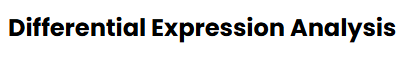
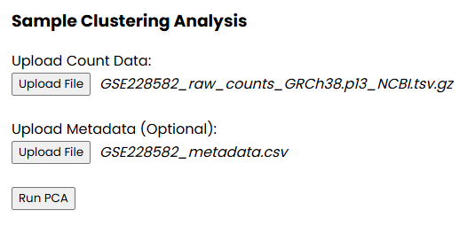
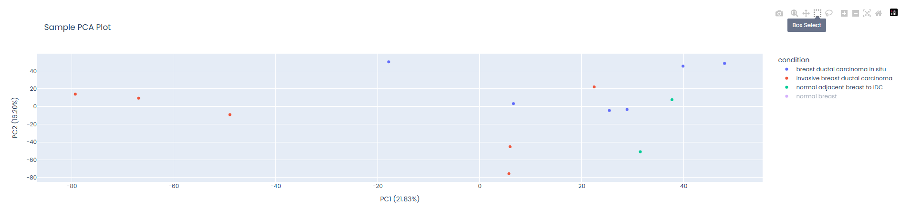
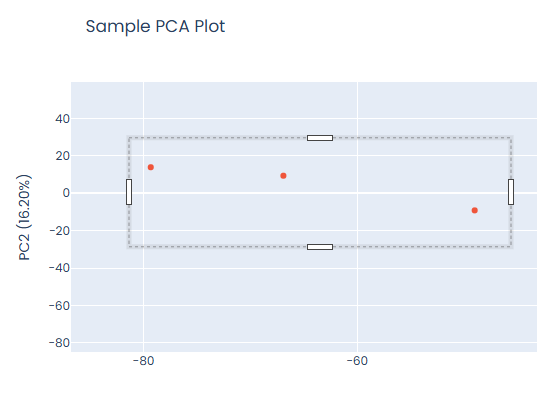
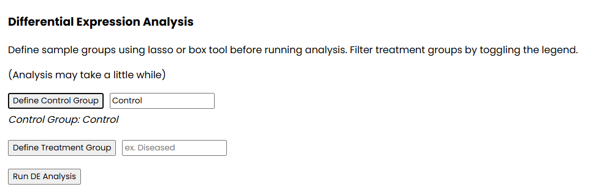

# RN-able
## Web applications for exploratory RNA-Seq Analysis


## Differential Expression Analysis Quick Start Guide


### Step 1: Clone the Repository

```bash
git clone https://github.com/rbednarek/rn-able.git
cd rn-able
```

### Step 2: Set Up Conda Environment

Run the setup_environment script to create a new conda environment and install all required dependencies:

```bash
./setup_environment.sh
```

This script will:
- Create a new conda environment named `rnable`
- Install all necessary R/Python packages and dependencies

### Step 3: Activate the Environment

After the setup script completes, activate the conda environment if necessary:

```bash
conda activate rnable
```

### Step 4: Launch the PCA Dash Application

Navigate to the apps folder and run the Dash application:

```bash
cd apps
python pca_dash.py
```

The application will start and display a local URL (typically `http://127.0.0.1:8050/`) where you can access the dashboard in your web browser.

## Tutorial Dataset

For tutorial and testing purposes, we've included sample datasets in the `test_datasets` folder:

- **Raw Counts Data**: `GSE228582_raw_counts_GRCh38.p13_NCBI.tsv.gz`
- **Metadata**: `GSE228582_metadata.csv`

These files provide a complete example of the expected data format and can be used to familiarize yourself with the application's functionality. Data was obtained from the Gene Expression Omnibus ([GSE228582](https://www.ncbi.nlm.nih.gov/geo/query/acc.cgi?acc=GSE228582))

### Example Analysis

1. Launch the PCA Dash application
2. In the file upload interface, select:
   - Raw counts file: `test_datasets/GSE228582_raw_counts_GRCh38.p13_NCBI.tsv.gz`
   - Metadata file: `test_datasets/GSE228582_metadata.csv`



3. After generating the PCA, use either the Box Select or Lasso tool to select control samples. Name the control group before defining. Repeat this process for treatment group. 





4. Run analysis and download DE results and user-defined sample meta data.


## Troubleshooting

If you encounter any issues:

1. **Environment Setup Problems**: Ensure you have conda installed and the setup script has execute permissions (`chmod +x setup_environment.sh`)
2. **Missing Dependencies**: Re-run the setup script or manually install missing packages with `conda install` or `pip install`
3. **Port Already in Use**: If the default port is occupied, the application will typically find an available port automatically, otherwise manually update the port in pca_dash.py script.

## Requirements

- Python 3.10+
- Conda package manager

## Data Format Requirements

- **Raw Counts**: Tab or comma separated values file (can be .gz compressed)
- **Metadata**: Tab or comma separated file with sample information matching the raw counts columns

---

For additional support or questions, please refer to the application documentation or contact the development team.


# Secondary Analysis Applications Coming Soon!